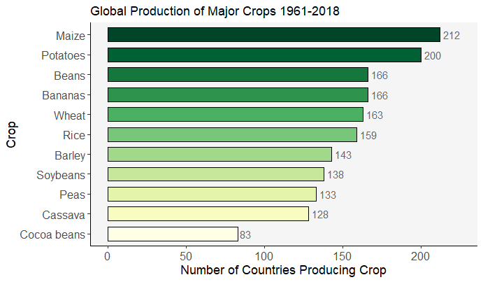

```{r setup, include=FALSE,}
knitr::opts_chunk$set(echo = TRUE)


library(ggplot2)
library(RColorBrewer)
```

We chose the Tidy Tuesday's "Key Crop Yields" data set, which shows the annual crop yields of over 200 entities from the years 1961-2018.

```{r data, eval = FALSE}
tuesdata <- tidytuesdayR::tt_load('2020-09-01')
tuesdata <- tidytuesdayR::tt_load(2020, week = 36)
key_crop_yields <- tuesdata$key_crop_yields
```


### Preliminary Analysis

How many countries grow each crop in our data set?

```{r Hannah, eval = FALSE}
### plot showing number of countries that produce each crop forming the barplot
barplot<- cropcounts%>%
  mutate(crop=fct_reorder(crop,`Number of producing entities`))%>%
  ggplot(aes(x=crop,y=`Number of producing entities`),show.legend=FALSE)+
  geom_bar(colour="black",stat="identity",aes(fill=as.factor(crop)),width=0.7,show.legend=FALSE)+
  coord_flip()+
  xlab("Crop")+
  ylab("Number of Countries Producing Crop")+
  expand_limits(y=c(0,225))

###Adjusting labels and creating colors to fill bars
croplabs<- c("Cocoa beans","Cassava","Peas","Soybeans","Barley","Rice","Wheat","Bananas","Beans","Potatoes","Maize")
numcol<- 11
colors<-colorRampPalette(brewer.pal(9,"YlGn"))(numcol)

###Formatting barplot with axis labels, title, colors, and theme. Also added data labels to show value next to bars
barplot+scale_x_discrete(labels=croplabs)+
  ggtitle("Global Production of Major Crops 1961-2018")+
  scale_fill_manual(values=colors)+
  theme_classic()+
  theme(panel.background = element_rect(fill="gray96"),axis.text = element_text(size=12),axis.title=element_text(size=13.5))+
  geom_text(aes(label=cropcounts$`Number of producing entities`),color="gray40",hjust=-.2)
```


### Further Analyses

After finding the previous data, we decided to take a close look at maize, the crop that the most entities (212) had produce during this time period.  We selected all 212 countries, and averaged their maize yields over the time period to show the top maize producers, with 1SD error bars.


```{r eval = TRUE, include = FALSE}
avg_maize_df2 <- read.csv("/Users/grace/Documents/Grad School Yr 1/R/CPSC_441_personal/Group_5/Data/maize_graph_data.csv")
colors_maize<-colorRampPalette(brewer.pal(172,"YlGn"))(172)
```


```{r eval = TRUE, dpi=200, fig.height = 8, fig.width = 4.7}
ggplot(avg_maize_df2, aes(x=reorder(Entity, avg_yield), y=avg_yield)) +
  geom_bar(stat = "identity", fill = colors_maize, color = NA) +
  coord_flip() +
  geom_errorbar(aes(ymin=avg_yield-sd, ymax=avg_yield+sd), width=0.5, position=position_dodge(.9)) +
  ggtitle("Historical Average Maize Yield (1961-2018)") +
  theme(axis.text.y=element_text(size = 3),
        axis.text.x=element_text(size = 4),
        aspect.ratio=3,
        plot.title = element_text(size = 9),
        axis.title.x = element_text(size=5),
        axis.title.y = element_text(size=5)) +
  labs(x = "Country", y = "Historical Average Yield (tonnes per hectare)") + 
  scale_y_continuous(breaks = seq(0, 40, 5)) 
```


From above we became intrigued by the exceptionally large error bars of places like Israel and Jordan.  While it is not surprising that the time span from 1961-2018 has highly variable yields, we wanted to visually map at least one country's crop production over time.  We selected Israel as the largest maize producer, and for it's high standard deviation.

```{r eval = FALSE}
ggplot(Israel_long, aes(x = Year, y = value, group = yield, color = yield)) +
  geom_line() +
  scale_color_viridis(discrete = TRUE) +
  ggtitle("Israel Historic Crop Yield", "1961-2018") +
  labs(x = "Year", y = "Annual Yield (tonnes per hectare)") +
  theme(legend.position = c(0.1, .85), 
        legend.title = element_text(size = 0), 
        legend.text = element_text(size=8), 
        plot.title = element_text(size = 20),
        axis.title.x = element_text(vjust=-1.5),
        axis.title.y = element_text(vjust=2))+
  scale_x_discrete(breaks = seq(1960, 2020, 5)) +
  scale_y_continuous(breaks = seq(0, 60, 10)) 
```


Potatoes came in a close second with 200 producing entities, and further analysis showed that while more entities produce maize, potatoes are the crop that is produced in the most volume.  Averaging the yields of every crop produced by every country, we found that potatoes were the highest average yield of 98 countries.


```{r eval = TRUE, include = FALSE}
colors_potato<-colorRampPalette(brewer.pal(98,"YlGn"))(98)
  potato_entities <- read.csv("/Users/grace/Documents/Grad School Yr 1/R/CPSC_441_personal/Group_5/Data/potato_graph_data.csv")
```

```{r eval = TRUE, dpi=200, fig.height = 6.5, fig.width = 4.7}
ggplot(potato_entities, aes(x=reorder(Entity, max_yield), y=max_yield)) +
  geom_bar(stat = "identity", fill = colors_potato, color = NA) +
  coord_flip() +
  geom_errorbar(aes(ymin=max_yield-sd, ymax=max_yield+sd), width=.5, position=position_dodge(.9)) +
  ggtitle("Historical Average Potato Yield (1961-2018)") +
  theme(axis.text.y=element_text(size = 4),
        axis.text.x=element_text(size = 4),
        aspect.ratio=1.8,
        plot.title = element_text(size = 9),
        axis.title.x = element_text(size=6),
        axis.title.y = element_text(size=6)) +
  labs(x = "Country", y = "Historical Average Yield (tonnes per hectare)")
```


### Organization and Presentation

Now that we know that the potato is the crop that countries have historically produced the most of, we decided that our final figure would be a world heat map of historical potato production, divided into four percentile groups.  

```{r Sarah, eval = FALSE}
full_country_buckets <- full_country_df %>%
  mutate(Buckets = ifelse(
    Crop_Percentile == 0,
    'NA',
    ifelse(
      Crop_Percentile > 0 & Crop_Percentile <= 0.25,
      '1-25th',
      ifelse(
        Crop_Percentile > 0.25 & Crop_Percentile <= 0.5,
        '25-50th',
        ifelse(
          Crop_Percentile > 0.5 & Crop_Percentile <= 0.75,
          '50-75th',
          ifelse(Crop_Percentile > 0.75 &
                   Crop_Percentile <= 1, '75-100th', NA)
        )
      )
    )
  ))

ggplot(full_country_buckets) +
  geom_sf(aes(geometry = geom, 
              fill = Buckets),
          color = 'black',
          size = 0.2) +
  geom_sf(data = subset(full_country_buckets, Crop_Percentile >= 0.9),
          mapping = aes(geometry = geom,
                        fill = Buckets),
          color = 'black',
          size = 0.3) +
  labs(title = 'Potato Yields Around the World',
       caption = 'Souces: Tidytuesday & Our World in Data',
       fill = 'Percentile:') +
  scale_fill_manual(values = c('white', 'yellow2', 'yellow3', 'yellow3', 'yellowgreen')) +
  theme(plot.title = element_text(face = 'bold', size = 25),
        legend.position = 'top',
        legend.text = element_text(size = 10),
        legend.title = element_text(size = 10),
        plot.subtitle = element_text(size = 10),
        plot.caption = element_text(size = 10),
        axis.title = element_blank(),
        axis.ticks = element_blank(),
        axis.text = element_blank(),
        strip.text = ggplot2::element_text(size = 12, hjust = 0, face = 'bold', color = 'black'),
        strip.background = element_rect(fill = NA),
        panel.background = ggplot2::element_blank(),
        axis.line = element_blank(),
        panel.grid.major.y = element_blank(),
        panel.grid.major.x = element_blank()
  ) 
```


### Happy Tidy Tuesday!

And we shared our final figure with the TidyTuesday hashtag on twitter!


